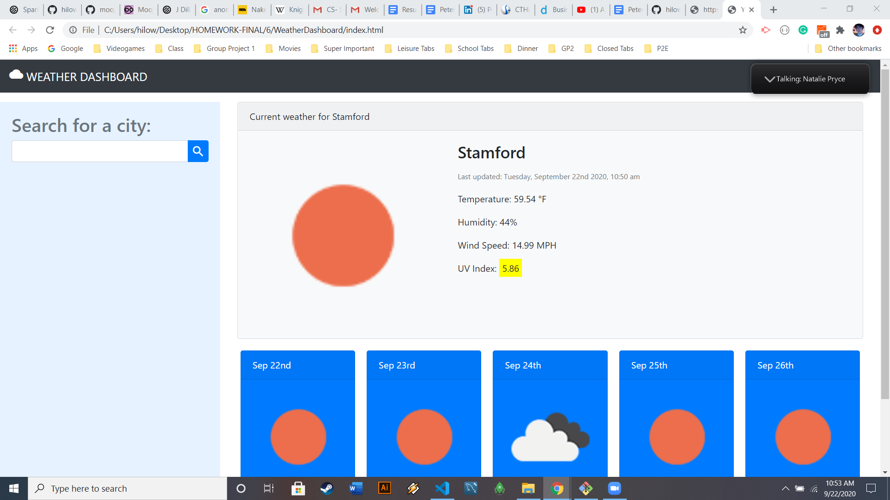

# Weather Dashboard

## Description

A weather dashboard which displays the current weather and forecast for a searched city. Users can search for a city, and if found the app will return the current weather, as well as a forecast of the next 5 days. The user's search history is saved as a button for them to quickly check the weather of that city again. It uses the OpenWeather API to retrieve data for the cities, AJAX to hook into the API to retrieve the data in JSON format, dynamically updated HTML and CSS powered by jQuery, and displays a search history which the user can click to access past cities searched via local storage. 

## Approach

I started by dividing the main task into smaller tasks:
1. Get the user input city
2. Send the request to the Openweather server and retrieve the current weather and forecast
3. Show the information on screen
4. Create a button that does the same thing as steps 2 and 3 for the weather in that city again

## Features

The UV Index information that is displayed changes background colors based on the UV Index value. Being exposed to strong ultraviolet rays for extended periods of time can be dangerous, causing sunburn and possibly skin cancer. The colors are depicted as follows:

Green - UVI under 3 (1-2), no protection advised.
Yellow - UVI under 6 (3-6), protection advised.
Orange - UVI under 8 (6-7), protection advised.
Red - UVI under 11 (8-10), protection strongly advised.
Purple - UVI 11+, protection strongly advised.

## Resources
This page was built using the API created and provided by Open Weather. It uses their APIs for current weather, 5 day / 3 hour weather forecast, and UV Index.

The geolocation API is built into the Chrome web browser.
https://getbootstrap.com/ - Bootstrap framework
https://fontawesome.com/ - Fontawesome framework
https://jquery.com/ - jQuery library

## Refrences

https://developer.mozilla.org/en-US/ - Various documentation
https://stackoverflow.com/ - Questions & Answers
https://en.wikipedia.org/ - Ultraviolet Index Information